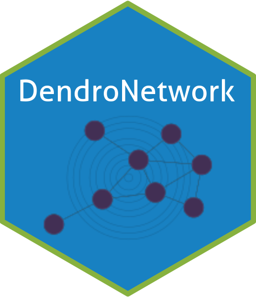

# DendroNetwork

{width="186"}

DendroNetwork is package to create dendrochronological networks for gaining insight into provenance or other patterns based on the statistical relations between tree ring curves. The code and the functions are based on several published papers [@visser2021a; @visser2021b; @visser2022]

## Installation

You can install the development version of DendroNetwork from [GitHub](https://github.com/RonaldVisser/DendroNetwork) with:

``` r
# install.packages("devtools")
devtools::install_github("RonaldVisser/DendroNetwork")
```

## Usage {#usage}

The package aims to make the creation of dendrochronological (provenance) networks as easy as possible. To be able to make use of all options, it is assumed that Cytoscape [@shannon2003]is installed (<https://cytoscape.org/>). Some data is included in this package, namely the Roman data published by Hollstein [@hollstein1980].

The first steps are visualized in the flowchart below, including community detection using either (or both) the Girvan-Newman algorithm [@girvan2002] and Clique Percolation Method [@palla2005] for all clique sizes.

```{r flowchart of workflow, echo=FALSE, fig.width=15}
DiagrammeR::grViz("
digraph {
  # graph attributes
  graph [overlap = true]
  # node attributes
  node [shape = box,
        fontname = Helvetica,
        color = gray]
  # edge attributes
  edge [color = black]
  # node statements
  1 [label = 'Load data']
  2 [label = 'Create similarity table']
  3 [label = 'Create network using default settings']
  4 [label = 'Detect communities using the \n Girvan-Newman algorithm']
  5 [label = 'Detect communities using the \n Clique Percolation Method']
  # edge statements
  1 ->  2
  2 -> 3
  3 -> 4
  3 -> 5
  }
")
```

```{r building a network with Hollstein (1980 data)}
library(DendroNetwork)
data(hol_rom) # 1
sim_table_hol <- sim_table(hol_rom) # 2
g_hol <- dendro_network(sim_table_hol) # 3
g_hol_gn <- gn_names(g_hol) # 4
g_hol_cpm <- clique_community_names(g_hol, k=3) # 4
hol_com_cpm_all <- find_all_cpm_com(g_hol) # 5
plot(g_hol)  # plotting the graph in R
plot(g_hol, vertex.color="blue", vertex.size=15, vertex.frame.color="gray",
     vertex.label.color="black", vertex.label.cex=0.8, vertex.label.dist=2) # better readable version
```

### Visualization in Cytoscape {#visualization_cytoscape}

After creating the network in R, it is possible to visualize the network using Cytoscape. The main advantage is that visualisation in Cytoscape is more easy, intuitive and visual. In addition, it is very easy to automate workflows in Cytoscape with R (using [RCy3](https://bioconductor.org/packages/release/bioc/html/RCy3.html)). For this purpose we need to start Cytoscape firstly. After Cytoscape has completely loaded, the next steps can be taken.

1.  The network can now be loaded in Cytoscape for further visualisation: `cyto_create_graph(g_hol, CPM_table = hol_com_cpm_all, GN_table = g_hol_gn)`
2.  Styles for visualisation can now be generated. However, Cytoscape comes with a lot of default styles that can be confusing. Therefore it is recommended to use: `cyto_clean_styles()` once in a session.
3.  To visualize the styles for CPM with only k=3: `cyto_create_cpm_style(g_hol, k=3, com_k = g_hol_cpm)`
    -   This can be repeated for all possible clique sizes. To find the maximum clique size in a network, please use: `igraph::clique_num(g_hol)`.
    -   To automate this: `for (i in 3:igraph::clique_num(g_hol)) { cyto_create_cpm_style(g_hol, k=i, com_k = g_hol_cpm)}`.
4.  To visualize the styles using the Girvan-Newman algorithm (GN): `cyto_create_gn_style(g_hol)` This would look something like this in Cytoscape:


## Usage for large datasets

When using larger datasets calculating the table with similarities can take a lot of time, but finding communities even more. It is therefore recommended to use of parallel computing for Clique Percolation: `clique_community_names_par(network, k=3, n_core = 6)`. This reduces the amount of time significantly.

The workflow is similar as above, but with minor changes:

1.  load network

2.  compute similarities

3.  find the maximum clique size: `igraph::clique_num(network)`

4.  detect communities for each clique size separately:

    -   `com_cpm_k3 <- clique_community_names_par(network, k=3, n_core = 6)`.

    -   `com_cpm_k4 <- clique_community_names_par(network, k=4, n_core = 6)`.

    -   and so on until the maximum clique size

5.  merge these into a single `data frame` by `com_cpm_all <- rbind(com_cpm_k3,com_cpm_k4, com_cpm_k5,... )`

6.  create table for use in cytoscape with all communities: `com_cpm_all <- com_cpm_all %>% dplyr::count(node, com_name) %>% tidyr::spread(com_name, n)`

7.  Continue with the visualisation in Cytoscape, see the previous [section on visualization in Cytoscape](#visualization_cytoscape)

## Citation

If you use this software, please cite this using:

Visser, R. (2023). DendroNetwork: a R-package to create dendrochronological provenance networks (Version 0.2.0) [Computer software]. <https://doi.org/xxx>

## References
