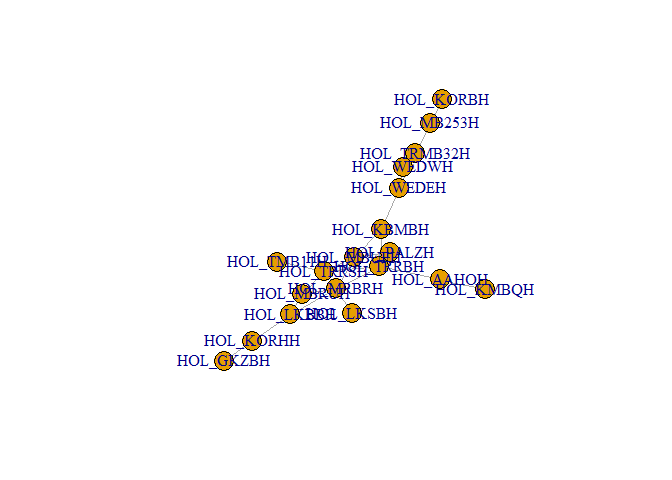

# dendroNetwork 

<!-- badges: start -->

[](https://www.repostatus.org/#active)
[](https://lifecycle.r-lib.org/articles/stages.html#stable)
[](https://github.com/RonaldVisser/dendroNetwork/actions/workflows/pkgcheck.yaml)
[](https://github.com/RonaldVisser/dendroNetwork/actions/workflows/R-CMD-check.yaml)
[](https://github.com/ropensci/software-review/issues/627)
[](https://zenodo.org/doi/10.5281/zenodo.10636310)

<!-- badges: end -->

dendroNetwork is a package to create dendrochronological networks for
gaining insight into provenance or other patterns based on the
statistical relations between tree ring curves. The code and the
functions are based on several published papers (Visser 2021b, 2021a;
Visser and Vorst 2022)

## Installation

This package depends on
[RCy3](https://www.bioconductor.org/packages/release/bioc/html/RCy3.html),
which is part of Bioconductor. Therefore it is recommended to install
RCy3 first using:

``` r
if (!require("BiocManager", quietly = TRUE))
    install.packages("BiocManager")

BiocManager::install("RCy3")
```

The functionaliy of RCy3 depends on the installation of Cytoscape. It is
therefore recommended to install Cyscape as well. Please follow the
download and installation instructions for your operating system:
<https://cytoscape.org/>.

You can install the development version of dendroNetwork from
[GitHub](https://github.com/RonaldVisser/DendroNetwork) with:

``` r
# install.packages("devtools")
devtools::install_github("RonaldVisser/dendroNetwork", build_vignettes = TRUE)
```

## Usage

The package aims to make the creation of dendrochronological
(provenance) networks as easy as possible. To be able to make use of all
options, it is assumed that Cytoscape (Shannon et al. 2003)is installed
(<https://cytoscape.org/>). Some data is included in this package,
namely the Roman data published by Hollstein (Hollstein 1980).

The first steps are visualized in the flowchart below, including
community detection using either (or both) the Girvan-Newman algorithm
(Girvan and Newman 2002) and Clique Percolation Method (Palla et al.
2005) for all clique sizes.

<!-- -->

``` r
library(dendroNetwork)
data(hol_rom) # 1
sim_table_hol <- sim_table(hol_rom) # 2
g_hol <- dendro_network(sim_table_hol) # 3
g_hol_gn <- gn_names(g_hol) # 4
g_hol_cpm <- clique_community_names(g_hol, k=3) # 4
hol_com_cpm_all <- find_all_cpm_com(g_hol) # 5
plot(g_hol)  # plotting the graph in R
```

<!-- -->

``` r
plot(g_hol, vertex.color="deepskyblue", vertex.size=15, vertex.frame.color="gray",
     vertex.label.color="darkslategrey", vertex.label.cex=0.8, vertex.label.dist=2) # better readable version
```

<!-- -->

### Visualization in Cytoscape

After creating the network in R, it is possible to visualize the network
using Cytoscape. The main advantage is that visualisation in Cytoscape
is more easy, intuitive and visual. In addition, it is very easy to
automate workflows in Cytoscape with R (using
[RCy3](https://bioconductor.org/packages/release/bioc/html/RCy3.html)).
For this purpose we need to start Cytoscape firstly. After Cytoscape has
completely loaded, the next steps can be taken.

1.  The network can now be loaded in Cytoscape for further
    visualisation:
    `cyto_create_graph(g_hol, CPM_table = hol_com_cpm_all, GN_table = g_hol_gn)`
2.  Styles for visualisation can now be generated. However, Cytoscape
    comes with a lot of default styles that can be confusing. Therefore
    it is recommended to use: `cyto_clean_styles()` once in a session.
3.  To visualize the styles for CPM with only k=3:
    `cyto_create_cpm_style(g_hol, k=3, com_k = g_hol_cpm)`
    - This can be repeated for all possible clique sizes. To find the
      maximum clique size in a network, please use:
      `igraph::clique_num(g_hol)`.
    - To automate this:
      `for (i in 3:igraph::clique_num(g_hol)) { cyto_create_cpm_style(g_hol, k=i, com_k = g_hol_cpm)}`.
4.  To visualize the styles using the Girvan-Newman algorithm (GN):
    `cyto_create_gn_style(g_hol)` This would look something like this in
    Cytoscape:

<figure>

<figcaption aria-hidden="true">The network of Roman sitechronologies
with the Girvan-Newman communities visualized.</figcaption>
</figure>

## Usage for large datasets

When using larger datasets calculating the table with similarities can
take a lot of time, but finding communities even more. It is therefore
recommended to use of parallel computing for Clique Percolation:
`clique_community_names_par(network, k=3, n_core = 6)`. This reduces the
amount of time significantly.

The workflow is similar as above, but with minor changes:

1.  load network

2.  compute similarities

3.  find the maximum clique size: `igraph::clique_num(network)`

4.  detect communities for each clique size separately:

    - `com_cpm_k3 <- clique_community_names_par(network, k=3, n_core = 6)`.

    - `com_cpm_k4 <- clique_community_names_par(network, k=4, n_core = 6)`.

    - and so on until the maximum clique size

5.  merge these into a single `data frame` by
    `com_cpm_all <- rbind(com_cpm_k3,com_cpm_k4, com_cpm_k5,... )`

6.  create table for use in cytoscape with all communities:
    `com_cpm_all <- com_cpm_all %>% dplyr::count(node, com_name) %>% tidyr::spread(com_name, n)`

7.  Continue with the visualisation in Cytoscape, see the previous
    [section on visualization in Cytoscape](#visualization_cytoscape)

## Citation

``` r
citation("dendroNetwork")
#> Warning in citation("dendroNetwork"): could not determine year for
#> 'dendroNetwork' from package DESCRIPTION file
#> To cite package 'dendroNetwork' in publications use:
#> 
#>   Visser R (????). _dendroNetwork: Create networks of
#>   dendrochronological series using pairwise similarity_. R package
#>   version 0.5.2, https://ronaldvisser.github.io/dendroNetwork/,
#>   <https://github.com/RonaldVisser/dendroNetwork>.
#> 
#> A BibTeX entry for LaTeX users is
#> 
#>   @Manual{,
#>     title = {dendroNetwork: Create networks of dendrochronological series using pairwise similarity},
#>     author = {Ronald Visser},
#>     note = {R package version 0.5.2, https://ronaldvisser.github.io/dendroNetwork/},
#>     url = {https://github.com/RonaldVisser/dendroNetwork},
#>   }
```

If you use this software, please cite this using:

Visser, R. (2024). dendroNetwork: a R-package to create
dendrochronological provenance networks (Version 0.5.1) \[Computer
software\]. <https://zenodo.org/doi/10.5281/zenodo.10636310>

## Acknowledgements

This package reuses and adapts the CliquePercolationMethod-R package
developed by Angelo Salatino (The Open University). Source
code: [https://github.com/angelosalatino/CliquePercolationMethod-R](https://eur05.safelinks.protection.outlook.com/?url=https%3A%2F%2Fgithub.com%2Fangelosalatino%2FCliquePercolationMethod-R&data=05%7C02%7Cr.m.visser%40saxion.nl%7C98bf86e9d8de4bec4aff08dc2c74ce15%7Ca77b0754fdc14a62972c8425ffbfcbd2%7C0%7C0%7C638434127387203622%7CUnknown%7CTWFpbGZsb3d8eyJWIjoiMC4wLjAwMDAiLCJQIjoiV2luMzIiLCJBTiI6Ik1haWwiLCJXVCI6Mn0%3D%7C0%7C%7C%7C&sdata=14k0ITGo4Z%2FhQZv28AF0rCIbxu23PVvmxsC95Iu4ZFo%3D&reserved=0 "Original URL: https://github.com/angelosalatino/CliquePercolationMethod-R. Click or tap if you trust this link.")

This package reuses and adapts the function cor.with.limit.R() developed
by Andy Bunn (Western Washington University), but the new function is
optimized and also outputs the number of overlapping rings. Source code:
<https://github.com/AndyBunn/dplR/blob/master/R/rwi.stats.running.R>.

## References

<div id="refs" class="references csl-bib-body hanging-indent"
line-spacing="2">

<div id="ref-girvan2002" class="csl-entry">

Girvan, M and Newman, MEJ. 2002 Community structure in social and
biological networks. *Proceedings of the National Academy of Sciences of
the United States of America* 99(12): 7821–7826. DOI:
https://doi.org/[10.1073/pnas.122653799](https://doi.org/10.1073/pnas.122653799).

</div>

<div id="ref-hollstein1980" class="csl-entry">

Hollstein, E. 1980. *Mitteleuropäische eichenchronologie. Trierer
dendrochronologische forschungen zur archäologie und kunstgeschichte.*
Trierer grabungen und forschungen 11. Mainz am Rhein: Verlag Philipp von
Zabern.

</div>

<div id="ref-palla2005" class="csl-entry">

Palla, G, Derenyi, I, Farkas, I and Vicsek, T. 2005 Uncovering the
overlapping community structure of complex networks in nature and
society. *Nature* 435(7043): 814–818. DOI:
https://doi.org/[10.1038/nature03607](https://doi.org/10.1038/nature03607).

</div>

<div id="ref-shannon2003" class="csl-entry">

Shannon, P, Markiel, A, Ozier, O, Baliga, NS, Wang, JT, Ramage, D, Amin,
N, Schwikowski, B and Ideker, T. 2003 Cytoscape: A software environment
for integrated models of biomolecular interaction networks. *Genome
Research* 13(11): 2498–2504. DOI:
https://doi.org/[10.1101/gr.1239303](https://doi.org/10.1101/gr.1239303).

</div>

<div id="ref-visser2021b" class="csl-entry">

Visser, RM. 2021a Dendrochronological Provenance Patterns. Network
Analysis of Tree-Ring Material Reveals Spatial and Economic Relations of
Roman Timber in the Continental North-Western Provinces. *Journal of
Computer Applications in Archaeology* 4(1): 230253. DOI:
https://doi.org/[10.5334/jcaa.79](https://doi.org/10.5334/jcaa.79).

</div>

<div id="ref-visser2021a" class="csl-entry">

Visser, RM. 2021b On the similarity of tree-ring patterns: Assessing the
influence of semi-synchronous growth changes on the
Gleichläufigkeitskoeffizient for big tree-ring data sets. *Archaeometry*
63(1): 204–215. DOI:
https://doi.org/<https://doi.org/10.1111/arcm.12600>.

</div>

<div id="ref-visser2022" class="csl-entry">

Visser, RM and Vorst, Y. 2022 Connecting Ships: Using
Dendrochronological Network Analysis to Determine the Wood Provenance of
Roman-Period River Barges Found in the Lower Rhine Region and Visualise
Wood Use Patterns. *International Journal of Wood Culture* 3(1-3):
123–151. DOI:
https://doi.org/[10.1163/27723194-bja10014](https://doi.org/10.1163/27723194-bja10014).

</div>

</div>
