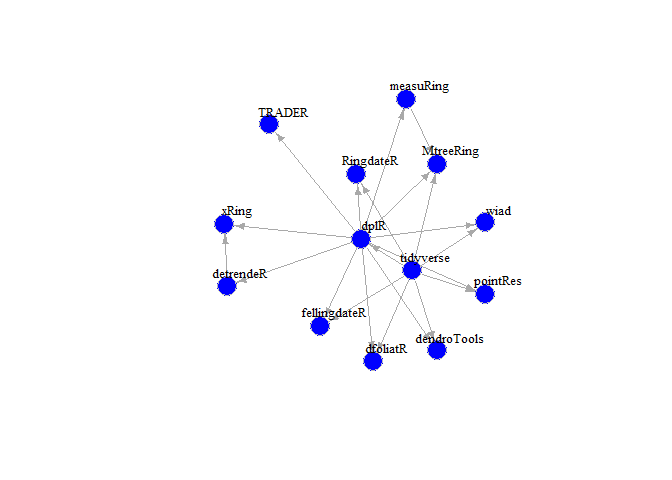

# Summary

The R-package dendroNetwork aims to make network analyses of dendrochronological data accessible for researchers. DendroNetwork enables researchers to easily construct a network of dendrochronological series based on the similarity and find patterns of matching tree-ring material. The detection of patterns is assisted by the easy application of community detection and subsequent (automated) visualization using Cytoscape. This enables dendrochronologists and other researchers to apply networks analyses to understand patterns of similarity between tree-ring series.

# Introduction

Dendrochronological analyses are often based on the comparison of tree-ring series with other tree-ring series. These comparions are often visualised as tabular data. However, to analyse the complex system of relations between tree-ring curves other methods are necessary. The author has developed a method to analyse patterns of similarity between tree-ring series using network analysis [@visser2021; @visser2022]. The analyses of these papers was mostly based on scripts that are shared with the papers [@visser; @visser]. For others to apply the developed method with these scripts is possible, but cumbersome and various things need to be changed. In addition, to try the network approach on dendrochronological data for the first time can be overwhelming an seemingly difficult. To make this more easy and accessible a new package for R has been designed to help users to apply this method to their data. The package DendroNetwork enables researchers to create tables with the similarity using various measures and visualize these using R [@rcoreteam2022] and Cytoscape [@otasek2019; @shannon2003a].

# Statement of need

There are several packages available in R for dendrochronological research [@guiterman2020; @jevsenak2018; @campelo2012; @bunn2008; @shi2019; @vandermaaten-theunissen2015; @reynolds2021; @altman2014; @rademacher; @campelo2019; @alday2018]. An overview with links to these packages can be found online (<https://github.com/RonaldVisser/Dendro_R>). These R-packages in dendrochronology all fill different needs, but the nice thing is that these are all interconnected in some way in depending on each other, or that they build further into different avenues. Apart from depending on dendrochronological packages, various packages from the Tidyverse [@wickham2019] are often also needed. The various relations can easily be visualised using a network, with the edges based on the dependency of two packages on each other, and and arrow indicating the direction of the dependency.

<!-- -->

The network shows that nearly all packages depend on dplR [@bunn2008]. The newly created package DendroNetwork fits in this ecosystem of depending packages, since it depends on both dplR and the Tidyverse. In addition, it adds a whole new world by adding network analyses through igraph [@csardi2006] to the ecosystem of dendrochronological packages. The igraph library has close connections to the tidyverse, creating a full circle and filling a gap as shown in the networks below.


# Workflow using dendroNetwork

The typical workflow when using the package consists of a number of successive steps. The result of each step is input for the next step.

<div class="figure">

```{=html}
<div class="grViz html-widget html-fill-item" id="htmlwidget-4cac386989c0fde4dfab" style="width:384px;height:480px;"></div>
<script type="application/json" data-for="htmlwidget-4cac386989c0fde4dfab">{"x":{"diagram":"\ndigraph {\n  # graph attributes\n  graph [overlap = true]\n  # node attributes\n  node [shape = box,\n        fontname = Helvetica,\n        color = gray]\n  # edge attributes\n  edge [color = black]\n  # node statements\n  1 [label = \"Load data\"]\n  2 [label = \"Create similarity table\"]\n  3 [label = \"Create network using default settings\"]\n  4 [label = \"Detect communities using the \n Girvan-Newman algorithm\"]\n  5 [label = \"Detect communities using the \n Clique Percolation Method\"]\n  6 [label = \"Visualization in Cytoscape\"]\n  # edge statements\n  1 ->  2\n  2 -> 3\n  3 -> 4\n  3 -> 5\n  4 -> 6\n  5 -> 6\n  }\n","config":{"engine":"dot","options":null}},"evals":[],"jsHooks":[]}</script>
```

<p class="caption">The typcial workflow when using dendroNetwork to visualise a network</p>
</div>

This first step is to load the dendrochronological data into the R environment using dplR:


```r
library(dendroNetwork)
data(hol_rom)
```

The next step would involve calculating the similarities between each tree-ring series in the dataset.


```r
sim_table_hol <- sim_table(hol_rom)
```

In the next step edges of the network are created based on the similarity. Each similarity between two curves above certain threshold settings will result in an edge in the network. The default settings are 0.5 for the correlation, 0.7 for the Synchronous Growth Changes or sgc [@visser2021a] with a probability of exceedence below 0.0001.


```r
g_hol <- dendro_network(sim_table_hol)
```

The next steps will be to find communities using either the Girvan-Newman algorithm [@girvan2002] or clique percolation method [@palla2005] , or both.


```r
g_hol_gn <- gn_names(g_hol)
g_hol_cpm <- clique_community_names(g_hol, k=3)
hol_com_cpm_all <- find_all_cpm_com(g_hol)
```

The next step is to visualize and explore the networks using Cytoscape or using R. Various functions are available to create visual styles for the communities in Cytoscape from R.


```r
plot(g_hol, vertex.color="deepskyblue", vertex.size=15, vertex.frame.color="gray",
     vertex.label.color="darkslategrey", vertex.label.cex=0.8, vertex.label.dist=2)
```

<!-- -->

The main advantage is that visualisation in Cytoscape is more easy, intuitive and visual. In addition, it is very easy to automate workflows in Cytoscape with R (using [RCy3](https://bioconductor.org/packages/release/bioc/html/RCy3.html)). For this purpose we need to start Cytoscape firstly. After Cytoscape has completely loaded, the next steps can be taken.

1.  The network can now be loaded in Cytoscape for further visualisation: `cyto_create_graph(g_hol, CPM_table = hol_com_cpm_all, GN_table = g_hol_gn)`
2.  Styles for visualisation can now be generated. However, Cytoscape comes with a lot of default styles that can be confusing. Therefore it is recommended to use: `cyto_clean_styles()` once in a session.
3.  To visualize the styles for CPM with only k=3: `cyto_create_cpm_style(g_hol, k=3, com_k = g_hol_cpm)`
    -   This can be repeated for all possible clique sizes. To find the maximum clique size in a network, please use: `igraph::clique_num(g_hol)`.
    -   To automate this: `for (i in 3:igraph::clique_num(g_hol)) { cyto_create_cpm_style(g_hol, k=i, com_k = g_hol_cpm)}`.
4.  To visualize the styles using the Girvan-Newman algorithm (GN): `cyto_create_gn_style(g_hol)` This would look something like this in Cytoscape:


# Conclusion

The new R package dendroNetwork has been developed based on earlier research by the author. To enable other researchers to use network analyses on dendrochronological data this new package fills a gap that exists in the current network of R-packages related to dendrochronology by also connecting igraph to the existing packages in the discipline. The creation of networks in R is made easy with various functions and the visualization in Cytoscape is automated in R, enabling the researcher to quickly visualise and analyse the resulting networks in an intuitive manner. The package is easy to use and enables reproducible network analyses within dendrochronology.

# Acknowledgements

# References
