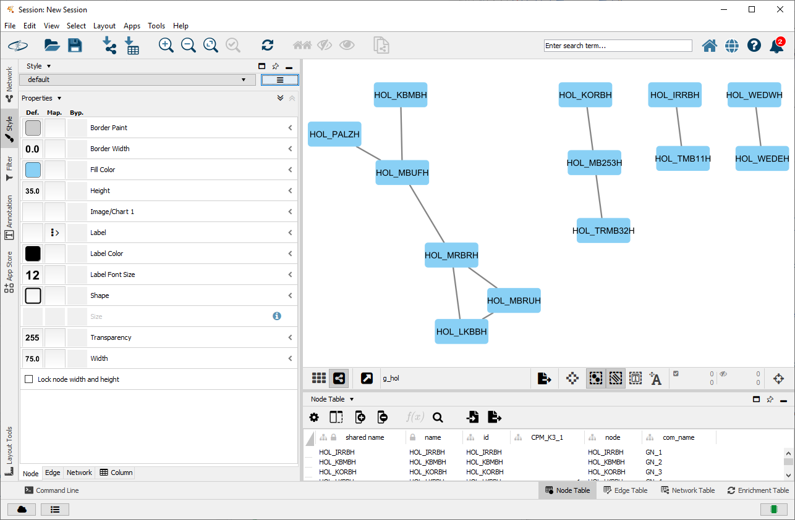

```{r, include = FALSE}
knitr::opts_chunk$set(
  collapse = TRUE,
  comment = "#>"
)
```

```{r setup}
library(dendroNetwork)
```

# Required Software

dendroNetwork uses RCy3 (<https://www.bioconductor.org/packages/release/bioc/html/RCy3.html>) to connect with Cytoscape and visualize networks. Cytoscape is open source software and platform independent and provides easy visual access to complex networks, including the attributes of both nodes and edges in a network (see the [Cytoscape-website](https://cytoscape.org/what_is_cytoscape.html) for more information). You will need to install and launch Cytoscape:

-   Download the latest Cytoscape from <http://www.cytoscape.org/download.php>

-   Complete installation wizard

-   Launch Cytoscape

To check if Cytoscape if completely loaded please run:

```         
cytoscapePing()
```

# Creation of networks

The creation of dendrochronological networks is done in R using the dendroNetwork package (see readme or the vignette [dendroNetwork: how to use it](dendroNetwork_use.html).

```{r}
library(dendroNetwork)
data(hol_rom) # 1
sim_table_hol <- sim_table(hol_rom) # 2
g_hol <- dendro_network(sim_table_hol) # 3
g_hol_gn <- gn_names(g_hol) # 4
hol_com_cpm_all <- find_all_cpm_com(g_hol) # 5
```

After the networks are created, the next step would be to visualize these in Cytoscape.

# Networks in Cytoscape

To visualise a dendrochronological network in Cytoscape:

``` r
cyto_create_graph(g_hol, CPM_table = hol_com_cpm_all, GN_table = g_hol_gn)
```

This results in Cytoscape as the following:

{width="800"}

The next step would be to add styles for visualisation. However, Cytoscape comes with a lot of default styles that can be confusing. Therefore it is recommended to use once in each session:

``` r
cyto_clean_styles()
```

It is not possible to visualize the styles for example for the Girvan Newman Algorithm:

``` r
cyto_create_gn_style(g_hol)
```

This results in Cytoscape as the following:

{width="800"}

Visualizing the Clique Percolation communities in Cytoscape for the network could be done using

``` r
cyto_create_cpm_style(g_hol, k=3, com_k = hol_com_cpm_all)
```

However, this would make not much sense in this example, since there is only one full clique with k=3 .
